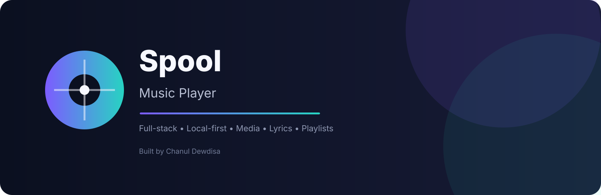
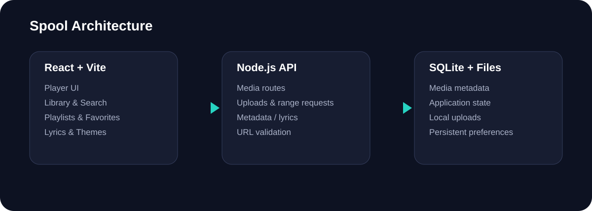

# Spool Music Player

<p align="center">
  
</p>

<p align="center">
  <strong>A full-stack local-first music & media player built with React, Vite, Node.js and SQLite.</strong>
</p>

<p align="center">
  <a href="https://github.com/DewdisaC/Spool-Music-Player/stargazers"></a>
  <a href="https://github.com/DewdisaC/Spool-Music-Player/network/members"></a>
  
  
  
  
</p>

## Overview

**Spool Music Player** is a portfolio-grade full-stack media application focused on a clean, responsive and local-first playback experience.

It combines a React interface with a Node.js API and SQLite persistence to provide music/video playback, playlists, favorites, synced lyrics, metadata enrichment, online media support and local uploads in one application.

> **Project author:** [Chanul Dewdisa](https://github.com/DewdisaC)

## ✨ Features

- 🎵 MP3, WAV, OGG, M4A, AAC and FLAC playback
- 🎬 MP4 playback with a dedicated cinema-style stage
- ▶️ YouTube watch, youtu.be, Shorts and YouTube Music URL support through the embedded player
- 📝 LRC synced lyrics with media-clock based highlighting
- ❤️ Favorites and custom playlists
- 🔎 Library search by title, artist, album and mood
- ↕️ Audio/video filters and sorting
- 📤 Local media uploads up to 100 MB
- 🌐 Direct online audio/video URL support
- 🖼️ Automatic artwork and metadata enrichment
- 💾 SQLite-backed persistence
- ⚡ HTTP byte-range support for smoother media seeking
- 🌙 Persistent dark/light theme
- 📱 Responsive desktop, tablet and mobile layouts
- 🧹 Fresh installs remove old non-playable showcase/demo records automatically

## 🏗️ Architecture

<p align="center">
  
</p>

| Layer | Technology | Responsibility |
|---|---|---|
| UI | React 18 | Player, library, playlists, lyrics and responsive interface |
| Build | Vite 5 | Development server and production bundling |
| Backend | Node.js | API, media handling, persistence and proxy routes |
| Database | SQLite | Media metadata and application state |
| Playback | HTML5 Audio/Video | Audio/video playback and seeking |
| Icons | Lucide React | Consistent interface icons |

## 📁 Project Structure

```text
Spool-Music-Player/
├── assets/
│   ├── architecture.svg
│   ├── spool-banner.svg
│   └── ui-preview.svg
├── data/
│   └── uploads/
├── src/
│   ├── main.jsx
│   ├── SpoolApp.jsx
│   └── spool.css
├── .github/
│   └── workflows/
├── dev-runner.js
├── server.js
├── index.html
├── package.json
├── package-lock.json
├── vite.config.js
└── README.md
```

## 🚀 Getting Started

### Requirements

- Node.js 22+ recommended
- npm
- A modern Chromium, Firefox or Safari browser

Spool uses Node's built-in `node:sqlite` module, so use a recent Node.js release.

### Install

```bash
git clone https://github.com/DewdisaC/Spool-Music-Player.git
cd Spool-Music-Player
npm install
```

### Development

```bash
npm run dev
```

Open:

```text
http://localhost:5173
```

The development runner starts the Vite frontend and Spool API together.

### Production

```bash
npm run build
npm start
```

Then open:

```text
http://127.0.0.1:3001
```

## 📝 Synced Lyrics

Spool supports timestamped LRC lyrics such as:

```text
[00:12.50] First line
[00:17.20] Second line
```

LRCLIB line-synced lyrics are preferred when available. Plain lyrics are supported as a fallback and are distributed across the detected duration for readable auto-following.

urlLRCLIB documentationhttps://lrclib.net/docs

## 🌐 Online Media

Spool supports:

- Public direct audio URLs
- Public direct video URLs
- YouTube watch links
- youtu.be links
- YouTube Shorts links
- YouTube Music links

YouTube playback uses the embedded player. Direct media files use Spool's byte-range proxy.

The application does **not** bypass platform restrictions or provide YouTube downloads. Use online media and downloads only when you have the appropriate rights or permission.

## 💾 Local Data

Runtime application data is intentionally excluded from Git:

```text
data/spool.db
data/spool.db-shm
data/spool.db-wal
data/uploads/*
```

This keeps personal media, local databases and generated runtime files out of source control.

## 🧪 Engineering Focus

This project demonstrates practical full-stack development across:

- React component architecture
- Stateful media playback
- REST-style API design
- SQLite persistence
- Local binary uploads
- HTTP byte-range requests
- Media URL validation
- Metadata and lyrics enrichment
- Responsive CSS architecture
- Vite development and production builds
- Node.js server-side file handling

## 📌 Project Status

**Portfolio project — active source repository.**

The repository contains the application source, backend, configuration, documentation and project visuals required to run and understand Spool locally.

## 👤 Author

**Chanul Dewdisa**

Software Developer focused on full-stack web applications, mobile development, AI-integrated products and interactive experiences.

- GitHub: https://github.com/DewdisaC
- Portfolio: https://chanul-portfolio-2027.vercel.app/

## 📄 License

Released under the MIT License. See [LICENSE](./LICENSE).

---

<p align="center">
  Built with React, Node.js, SQLite and a lot of iteration.
</p>
